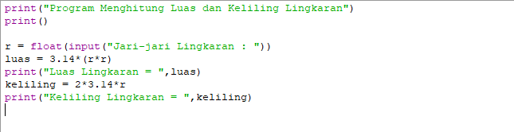

# Program Menghitung Luas dan Keliling Lingkaran

<h2>Rumus Luas dan Keliling Lingkaran</h2>

<ul type='disc'>
    <li>Untuk nilai phi yang akan kita gunakan adalah 3.14</li>
    <li>Dan "r" adalah jari-jari lingkaran</li>
</ul>

<h2>Flowchart Menghitung Luas dan Keliling Lingkaran</h2>

<h2>Program Python Menghitung Luas dan Keliling Lingkaran</h2>

