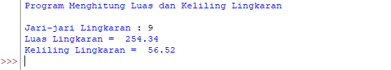

# Program Menghitung Luas dan Keliling Lingkaran

<h2>Rumus Luas dan Keliling Lingkaran</h2>

<ul type='disc'>
    <li>Untuk nilai phi yang akan kita gunakan adalah 3.14</li>
    <li>"r" adalah jari-jari lingkaran</li>
</ul>

<h2>Flowchart Menghitung Luas dan Keliling Lingkaran</h2>

<h2>Program Python Menghitung Luas dan Keliling Lingkaran</h2>

<h3>Penjelasan</h3>

<ul type='disc'>
    <li>Deklarasikan variable "r" yang bertipe data <b>float</b>, kemudian input jari-jari lingkaran ke dalam variable "r".</li>
    <li>Untuk perhitungan luas lingkaran, masukkan rumus luas lingkaran. Untuk phi menggunakan 3.14 dan simbol (*) merupakan perkalian. Lalu kalikan phi dengan variable "r".</li>
    <li>Untuk perhitungan keliling lingkaran, kalikan phi dengan 2 kemudian dikalikan lagi dengan variable "r".</li>
</ul>

<h3>Output Program :</h3>

<h3>-Terimakasih-</h3>